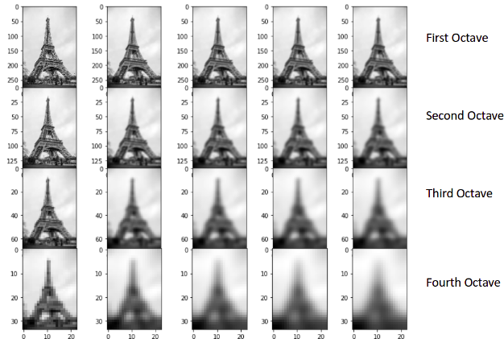
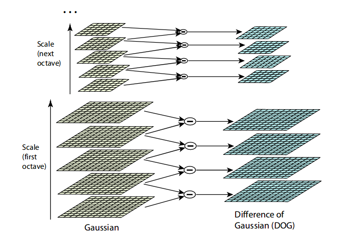
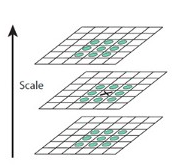
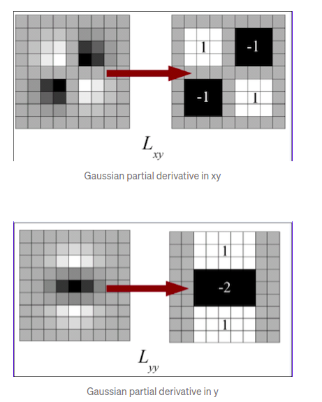
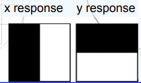
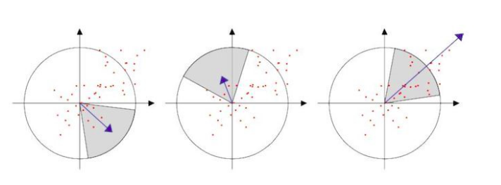

# Apply SIFT,SURF and ORB feature detector algorithm.
In this project Feature Detection algorithm is applied to the image specially the feature detect algorithm mentioned in the title.

## Prerequisites:
- opencv is required to run this project and if not install follow previous documentation on logistic setup 
- camke is also needed and if not install in your device you can use following syntax to install  
  ***`sudo apt-get install cmake`*** 

## Run the project
- Download the code from the Git
- open the folder you just downloaded in terminal , it contains other folders and files 
- Run ***`cmake -S . -B .`*** command
- After this, Run ***`make`*** command
- executable name **featuredetect** has been created 
- To check the output, Run ***`./featuredetect`*** command in terminal
- If user want to apply feature detect algorithm in specific images, the path to the images with their name and extension of images should be pass in ***`./featuredetect pathtotheimage/imagename.extension pathtotheimage/imagename.extension`*** . Two images are to be passed as feature are to be compared.
- To close all the window press key **'esc'** from the keyboard

## Input & Output:  
original images 
[original image ](photos/picture.png)

[original image 1 ](photos/picture2.png)

Keypoints on the supplied images using SIFT algorithm 
[Keypoints on the image](photos/output_.png)

[Keypoints on the image 1](photos/output_1.png)

SIFT Feature Descriptor output to match features  
[Descriptor output ](photos/output_descriptor.png)

Keypoints on the supplied images using SURF algorithm 
[Keypoints on the image](photos/output_surf.png)

[Keypoints on the image 1](photos/output_1_surf.png)

SURF Feature Descriptor output to match features  
[Descriptor output ](photos/output_descriptor_surf.png)

## FEATURE DETECTORS

---
## SIFT Feature Detector
SIFT feature detector stands for Scale-Invariant Feature Transform. In this, keypoints is extracted along with its orientation and descriptor is define for every keypoints so that scale as well as rotation of the image won't affect the keypoints. It contains of multiple steps where either keypoint is calculated, noise is removed from the keypoint, orientation is calculated for the keypoint or descriptor is created for respective keypoint. Followings are the steps taken to calcuate feature vector for the image.
- ### **Scale-space peak selection:**
  - ### Scale space:
  
    Two similar images can be vary vastly in various ascpect. Images can be for different sizes. In one Image objects might be closer than other image. Orientation of image or objects might not be same. So we need to consider those as even though image is rotated they are image of same thing so features of object detected in one image must be similar to that of another similar image. So Scale space invarient method is used where image of same size is blurred at different scale (sigma value)

    

  - ### Blurring:
  
    In space scale invarient method, we blurred image at different scale(sigma value). In order to blur, we convolve our input image with Gaussian kernel at different scale and different sigma value.
    
    $`\large\\ 
     \begin{aligned}
     &L(x,y,\sigma)=G(x,y,\sigma)*I(x,y)\\
     &\textcolor{gray}{Blured image}
     \end{aligned}\\
     `$

     G is the Gaussian Blur operator and I is an image. While x,y are the location coordinates and σ is the “scale” parameter. Think of it as the amount of blur. Greater the value, greater the blur.

     $`\large\\
     \begin{aligned}
     &G(x,y,\sigma)={\frac {1}{2\pi \sigma^2 }}e^{-{\frac {x^2-y^2 }{2\sigma^2 }}}\\
     &\textcolor{gray}{Gaussian Blur operator}
     \end{aligned}
    `$
    
    Images blurred with different sigma value and are called scale of the image. Images are reduce to half of its original size for every octave. So, basically for each input image, there will be scale of images with same size but blurred at different level in each octave. 
    
  - ### Difference of Gaussian kernel (DOG):
  
    Specially laplacian of Gaussian is used for extracting features of image. But instead of Laplacian of Gaussian we use Difference of Gaussian which produce similar type of result.  
    In Difference of Gaussian, Blurred images of similar size but different blurring scale are subtracted from one another to extract the the features or keypoints in the image. 

    $`D\left(x,y,\sigma \right)=L\left(x,y,k_{i}\sigma \right)-L\left(x,y,k_{j}\sigma \right)`$

    where $` L(x,y,k\sigma)`$ is the convolution of the original image Ix,y) with the Gaussian blur{\displaystyle $`G(x,y,k\sigma)`$ at scale $`k\sigma`$

    Difference of Gaussian between scales $`k_{i}\sigma`$  and $`k_{j}\sigma`$  is just the difference of the Gaussian-blurred images at scales $`k_{i}\sigma`$  and $`k_{j}\sigma`$.

    
  
  - ### Finding Keypoints: 
    After possible features that are extracted, there can be possiblity of noise so noises are to be the removed before going any further so any pixels value smaller than 0.03 are removed. One pixel in an image is compared with its 8 neighbors as well as 9 pixels in the next scale and 9 pixels in previous scales. If the keypoints is local maxima or local minima then they are consider as keypoint otherwise thery are discarded.

     
  
- ### **Keypoint Localization :**
  
  Obtained keypoints are not noise free as some still lack proper intensities and some lie at the edges. So we need to remove those. Alsoe location of some of the keypoints are not accurate. So Interpolation needs to be done. 
  To interpolate the location of keypoint accurately we used Taylor series expansion of the Difference of Gaussian i.e.

  $`{\displaystyle D({\textbf {x}})=D+{\frac {\partial D}{\partial {\textbf {x}}}}^{T}{\textbf {x}}+{\frac {1}{2}}{\textbf {x}}^{T}{\frac {\partial ^{2}D}{\partial {\textbf {x}}^{2}}}{\textbf {x}}}`$

  Here D(x) is intensity of interpolated pixel. To calculate the value by which we needs to move the keypoint.
  
  $`\large
  \begin{aligned}
  &h= -H^-1(x)\frac{dD}{dx}\\
  &where,\\
  &H(x)=\begin{bmatrix}
  D_{xx}&D_{xy}&D_{x\sigma}\\
  D_{xy}&D_{yy}&D_{y\sigma}\\
  D_{x\sigma}&D_{y\sigma}&D_{\sigma\sigma}
  \end{bmatrix}
  \\
  &\frac{dD}{dx}=\begin{bmatrix}
  \frac{dD}{dx}\\
  \frac{dD}{dy}\\
  \frac{dD}{d\sigma}
  \end{bmatrix}
  \end{aligned}
  `$

  D(x) further simplifies to

  $`\large D(x)=D+\frac{1}{2}\frac{\partial D}{\partial x}.h`$
  
  By calculating value of h we can get value by which x and y value is to be moved. And it is added to the keypoints co-ordinate. If interpolated pixel value i.e. **D(x)<=0.03** then it is discarded.

  Filter and interpolated keypoints still contains keypoints at the edge which should be removed. It is done by calculating eigen value of Hessian matrix.

  $`
  \begin{aligned}
  &H(x)=\begin{bmatrix}
  Dxx & Dxy\\ 
  Dyx & Dyy
  \end{bmatrix}\\
  &(Dxx+Dyy)^2/(Dxx*Dyy-(Dxy)^2)=(1+r)^2/r
  \\
  &r=\frac{\alpha}{\beta}=\frac{eigen\_value\_1}{eigen\_value\_2}
  \end{aligned}
  `$

  To remove the edge, If keypoint satisfies ***r>10*** then it is consider as keypoint other wise it is removed. 

- ### **Orientation Assignment:**

  Keypoints is caclulated based on the scale of the image and it is noise free so now to calculate the orientation neighbouring pixels around the keypoint is taken into consideration. Area which we take around keypoint depends upon scale in which keypoint exist.

  To calculate orientation Gradient of neighbouring pixels are calculate and plotted into histogram. Gradient magnitude and its orientation is calculated by following formula 

    $`\\
    m(x,y)=\sqrt{(L(x+1,y)-L(x-1,y))^2+(L(x,y+1)-L(x,y-1))^2}\\
    \theta(x,y)=\arctan2((L(x,y+1)-L(x,y-1)),(L(x+1,y)-L(x-1,y)))
  `$ 
  where **L(x,y)** is the pixel value of the coordinate x and y of the image in which keypoint resides. 

  This is calculated for every neighboring pixel around the key points and obtained theta and magnitude are stored in the histogram. For Histogram, bin of size 10 is created as a result for 0 to 360-degree angle there will be 36 bins. If an angle lies in any of the bins then respective gradient magnitude is weighted by Gaussian weighted circular window with *$`\sigma`$ 1.5* times scale of keypoint. Histogram is smoothed out and histogram that is smooth out is used to find orientation of keypoint. 
  The peaks are interpolated to obtain accurate orientation. The orientation with hisghest peak or peak that is 80% of that of highest peak is assigned to the keypoint.

- ### **Keypoint Descriptor:**

  Until now Keypoints are obtain which are scale invarient and does not depend upon rotation of an image. Now To calculate descriptor for the image window of size 16 * 16 is taken around keypoint. And each 16 * 16 window is divided into sub window of size 4 * 4 and for that subwindow histogram is created with 8 bin each. So for a 16 * 16 window there will be total of 128 bins which is descriptor for the given keypoint. In such a way for every keypoint descriptor of size 128 is found. 

  Histogram for 4 * 4 sub-matrix is weighted by Gaussian weight with sigma value half that of descriptor window. The obtained vector is interpolated using the trillinear interpolation so that boundary effect may be avoided. Form all the submatrix obtained vector of size 128 is then normalized to unit length so that constrast does not effect the gradient and any value greater then 0.2 is set to the threshold value so that effect of camera saturation might not effect the final oreintation output.

## SURF Feature Detector:
SURF feaature detector stands for Speeded Up Robust Features. Its' main feature is faste computational using concept of integral image and box filters. It is inspired by SIFT and depends upon SIFT feature detection algorithm for noise removal and keypoint localization. It can be use for real time computation , object tracking. Following steps are taken to implement this algorihtm.

- ### **Feature extraction:**
  - ### Integral images:
    For faster computation, SURF uses idea of integral images where each pixel value of image gives sum of previous pixel values.
    
    $`\Large
    S_{(x,y)}=\sum_{i=0}^x\sum_{j=0}^y I_{(i,j)}
    `$

    where $`\large I_{(i,j)}`$ is the intensity value of previous pixels.

  - ### Hessian matrix based interest points:
    Surf uses Hessian matrix based bold detector to extract the keypoints from the image. Rather than using laplacian of Gaussian or Difference of Gaussian, determinant of Hessian matrix is calculated which gives the interest point on the image. 

    $`
    H(x)=
    \left[\begin{array}{cc} 
    L_{xx}(p,\sigma ) & L_{xy}(p,\sigma )\\ 
    L_{xy}(p,\sigma ) & L_{yy}(p,\sigma )
    \end{array}\right]
    `$ 

    $`
    Det= (L_{xx}(p,\sigma )*L_{yy}(p,\sigma )-(L_{xy}(p,\sigma ))^2)
    `$

    where $` L_{xx}(p,\sigma ), L_{yy}(p,\sigma ), L_{xy}(p,\sigma )`$ is the convolution of the second-order derivative of gaussian with the image $` {\displaystyle I(x,y)}`$ at the point  $` {\displaystyle p} `$ .

    In order to calculate determinant of hessian matrix , covolution with gaussian kernel along with second order derivative but in SURF we use box filter whose output similar result as that of second order Gaussian derivative. Box filter along with integral image will drastically decrease computational time and it does not depend upon size of image as a result SURF become faster than SIFT. 
    9 x 9 filter mentioned above represent the second order gaussian derivative with $`\sigma=1.2`$ . These filters are not as perfect as Gaussian filter but are approximate to that so Deteminant of Hessian matrix becomes

    $`
    Det= (D_{xx}(p,\sigma )*D_{yy}(p,\sigma )-(0.9*D_{xy}(p,\sigma ))^2)
    `$

    where 0.9 is Bay's suggestion which as a result might get result close to that of Gaussian second order derivative. 
    

  - ### Scale-space representation:
    In SIFT operation, Image size was reduce with increase in scale. Images were blurred more aggresively as we go higher up in scale space pyramid. But in case of SURF instead of decreasing size of an image, Size of filter is being increased. Box filter of size 9 x 9 , 15 x 15 , 21 x 21 ,27 x 27 ... is used as we we go higher up in pyramid. The difference between scale changes from 6 to 12 12 to 24 as we change the octave of the images. To predict sigma value for appropriate filter 

    $`\begin{aligned}\\
    &s={\text{current filter size}}\times \left({\frac {\text{base filter scale}}{\text{base filter size}}}\right)\\
    &\text{where base filter scale = 1.2 and base filter size=9}
    \end{aligned}
    `$

    In order to localize interest points in the image and over scales, a nonmaximum suppression in a 3 × 3 × 3 neighborhood is applied similar to that of SIFT feature detection. 

- ### **Feature Description:**
  Feature description usually use two steps. First step is to find the orientation of the image and second steps include finding the descriptor.
  - ### Orientation assignment:
    SURF uses Haar wavelet response to determine orientation. Circle of Radius **6s** is taken around the keypoints. Horizontal and vertical filter of size **4s** was used across the matrix which lies inside the circle of radius **6s**. These two filters represent the wavelet transform across the row and column of the image. The output of these filter gives horizontal and vertical wavelet response. To decrease computational time, for a larger value of **s**, Integral images are used which only use six operations to compute the response in the x or y direction at any scale. Each output is weighted by Gaussian value with a sigma of **2.5s**.

    

    The dominant orientation is estimated by calculating the sum of all responses within a sliding orientation window covering an angle of 60 degrees. The horizontal and vertical responses within the window are summed. The two summed responses then yield a new vector. The longest such vector lends its orientation to the interest point.

    

  - ### Descriptor Components:
    To calculate the descriptor, first we take square region around the keypoint of size **20s** wheres is s is scale of keypoint in the same orientation as that of keypoint. Each area is divided into sub-areas, each of size **5s\*5s** as a result the **20s** window is divided into 4x4  smaller windows and for each subarea, Horizontal and vertical wavelets response are calculated i.e. dx and dy. The obtained response of wavelets in the sub-areas are added resulting in $`\sum{dx}`$ and $`\sum{dy}`$ . Not only that the absolute values are summed to obtain $`\sum{|dx|}`$ & $`\sum{|dy|}`$ .For Each sub-areas, there will be 4 vectors $`V=(\sum{dx},\sum{|dx|},\sum{dy},\sum{|dy|})`$ . Combining all those vector from all the sub areas, there will be a total of 64 vectors for each keypoint as a descriptor. 
